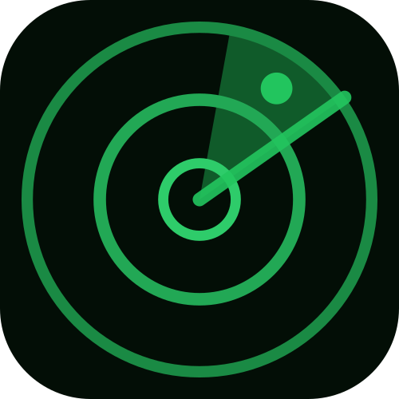

<h1>&nbsp; @squawk/mode-s</h1>

[](../../../LICENSE.md) [](https://www.npmjs.com/package/@squawk/mode-s) 

Decodes raw Mode-S/ADS-B messages: downlink format and CRC extraction, CPR
position, airborne velocity, aircraft identification, altitude (both the
ADS-B position-message field and legacy Gillham-coded surveillance replies),
squawk identity, and emergency status. Transport-agnostic - it operates on
already-framed message bytes and has no opinion about where they came from
(a live Beast feed, a logged capture, or any other source). For a Beast
binary parser and live TCP client built on top of this package, see
[`@squawk/beast`](../beast).

Part of the [@squawk](https://www.npmjs.com/org/squawk) aviation library suite. See all packages on npm.

## Installation

```bash
npm install @squawk/mode-s
```

## Usage

### Decoding a whole message

`decodeModeSMessage` is the main entry point - it reads the downlink format,
validates the CRC, and routes to the right per-type decoder, returning a
single discriminated result.

```typescript
import { decodeModeSMessage } from '@squawk/mode-s';

const decoded = decodeModeSMessage(rawMessageBytes); // 7 or 14 raw bytes
if (decoded?.kind === 'extendedSquitterPosition') {
  console.log(decoded.icaoHex, decoded.latCpr, decoded.lonCpr, decoded.altitudeFt);
}
```

DF17/18 (extended squitter) messages are only decoded when their CRC checks
out exactly - a corrupted squitter reports as undecodable rather than
returning plausible-looking wrong data. DF4/5/20/21 (Mode-S surveillance
replies) are targeted responses whose CRC is XORed with the responding
aircraft's ICAO address rather than being a plain checksum, so their
`candidateIcaoHex` needs cross-checking against an address already known
from squitter traffic before it can be trusted - this package doesn't
perform that cross-check itself.

### Resolving CPR position

Airborne and surface position messages carry raw CPR-encoded lat/lon
fields, not a directly usable position - resolving them needs either a
paired even/odd frame or a nearby reference position, and pairing state
(tracking the most recent even and odd frame per aircraft) is the caller's
responsibility, not this package's:

```typescript
import { decodeAirborneCprPair, decodeAirborneCprWithReference } from '@squawk/mode-s';

// From a paired even + odd frame (global decode, no reference needed)
const position = decodeAirborneCprPair(evenFrame, oddFrame, 'even');

// From a single frame plus a known-nearby reference (e.g. the aircraft's
// last known position, or the receiver's own location for a new aircraft)
const position2 = decodeAirborneCprWithReference('even', frame, referencePosition);
```

`decodeSurfaceCprPair` / `decodeSurfaceCprWithReference` are the equivalents
for on-ground traffic (type codes 5-8), which additionally need a reference
position to resolve the correct hemisphere and longitude quadrant.

### Mode A/C

Mode A/C predates Mode-S and carries no ICAO address, so it has no natural
key in an ICAO-hex-indexed tracking model - it's decoded here, but
deliberately not part of `decodeModeSMessage`'s dispatch:

```typescript
import { decodeModeAc } from '@squawk/mode-s';

const reply = decodeModeAc(twoRawBytes);
console.log(reply.squawk, reply.identActive, reply.altitudeFt);
```

## API

- `decodeModeSMessage(bytes)` - decodes a raw 7 or 14 byte Mode-S message into a discriminated `DecodedModeSMessage`.
- `decodeModeAc(bytes)` - decodes a raw 2-byte Mode A/C reply.
- `parseModeSFrame(bytes)`, `extractDownlinkFormat(bytes)`, `computeCrc24(bytes)` - lower-level envelope parsing, used internally by `decodeModeSMessage`.
- `decodeAirborneCprPair`, `decodeAirborneCprWithReference`, `decodeSurfaceCprPair`, `decodeSurfaceCprWithReference`, `cprNumLongitudeZones` - CPR position resolution.
- `decodeAirborneVelocity(me)` - airborne velocity/heading from a type-19 ME field.
- `decodeIdentification(me)` - callsign and category from a type 1-4 ME field.
- `decodeIdentityCode(idField)` - 4-digit octal squawk from a 13-bit identity field (shared by DF5/21 and ADS-B emergency status).
- `decodeAltitudeCode(altitudeCode)`, `decodeAdsbPositionAltitude(field)`, `decodeAdsbGnssAltitude(field)` - altitude decoding.
- `decodeSurfaceMovement(field)` - ground speed from a surface position message's movement field.
- `decodeEmergencyState(rawState)` - emergency/priority state from an ADS-B aircraft status message.

Every decoder that can fail to produce a result returns `undefined` rather
than throwing - a message that doesn't decode cleanly (unsupported type,
failed CRC, reserved value) is an expected outcome, not an exceptional one.
